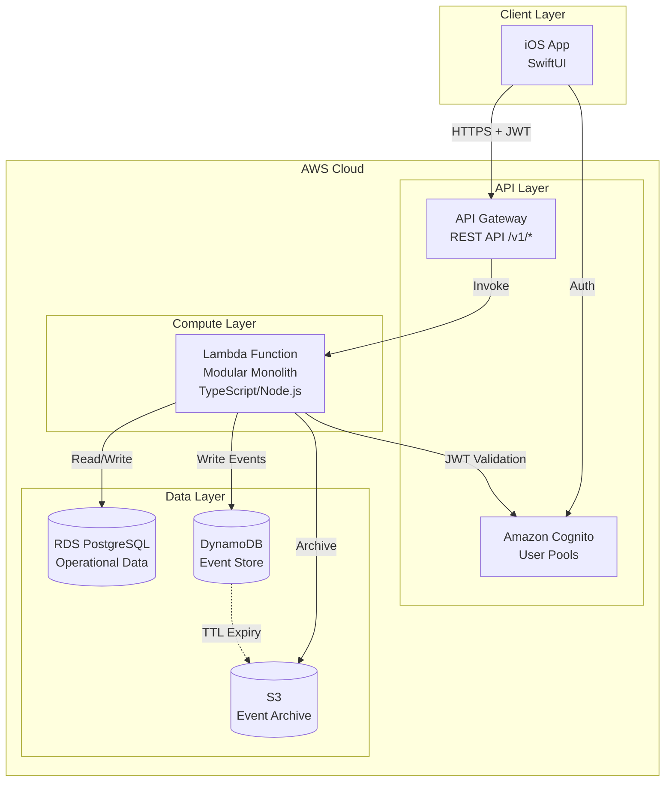
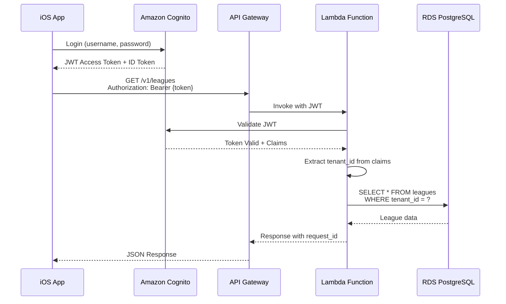
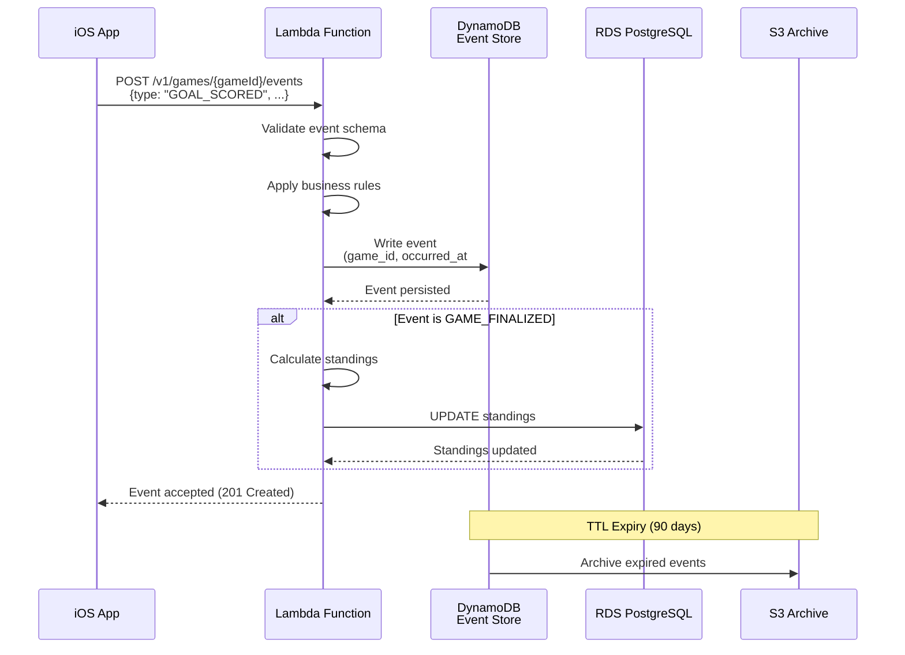

# Design Document: ScoreBase Backend

## Overview

The ScoreBase Backend is a multi-tenant, event-driven REST API that powers the ScoreBase iOS application. Built on AWS serverless infrastructure, it provides real-time game scores, team standings, schedules, and player statistics across multiple sports leagues. The architecture follows a Lean deployment model optimized for <20 leagues, using a modular monolith Lambda approach with event sourcing for game state management and multi-tenant isolation at every layer.

The backend is designed to be sport-agnostic from day 1, supporting basketball, soccer, hockey, baseball, and football through configurable data models. All game mutations produce immutable events stored in DynamoDB, enabling event replay, audit trails, and eventual consistency patterns. Operational data (leagues, teams, players, standings) is stored in RDS PostgreSQL for relational queries, while S3 provides long-term event archival.

## Architecture

### High-Level System Architecture



### Authentication Flow



### Event Sourcing Flow



## Components and Interfaces

### API Gateway Configuration

**Purpose**: Entry point for all HTTP requests, handles CORS, request validation, and JWT authorization.

**Configuration**:
- REST API with regional endpoint
- Custom domain with SSL certificate
- Request throttling: 1000 req/sec per tenant
- JWT authorizer using Cognito User Pool
- CORS enabled for iOS app domain

**Responsibilities**:
- Route requests to Lambda function
- Validate JWT tokens via Cognito authorizer
- Apply rate limiting per tenant
- Log all requests to CloudWatch
- Return standardized error responses

### Lambda Function (Modular Monolith)

**Purpose**: Core application logic handling all API endpoints, business rules, and data access.

**Interface**:
```typescript
// Main handler entry point
export async function handler(event: APIGatewayProxyEvent): Promise<APIGatewayProxyResult>

// Domain modules
interface LeagueService {
  getLeagues(tenantId: string): Promise<League[]>
  getLeagueById(tenantId: string, leagueId: string): Promise<League>
}

interface SeasonService {
  getSeasonsByLeague(tenantId: string, leagueId: string): Promise<Season[]>
  getSeasonById(tenantId: string, seasonId: string): Promise<Season>
}

interface TeamService {
  getTeamsByLeague(tenantId: string, leagueId: string): Promise<Team[]>
  getTeamById(tenantId: string, teamId: string): Promise<Team>
}

interface GameService {
  getGamesBySeason(tenantId: string, seasonId: string, filters?: GameFilters): Promise<Game[]>
  getGameById(tenantId: string, gameId: string): Promise<Game>
}

interface StandingsService {
  getStandingsBySeason(tenantId: string, seasonId: string): Promise<TeamStanding[]>
  recalculateStandings(tenantId: string, seasonId: string): Promise<void>
}

interface PlayerService {
  getPlayersByTeam(tenantId: string, teamId: string): Promise<Player[]>
  getPlayerById(tenantId: string, playerId: string): Promise<Player>
}

interface EventService {
  getEventsByGame(tenantId: string, gameId: string): Promise<GameEvent[]>
  createEvent(tenantId: string, gameId: string, event: CreateEventRequest): Promise<GameEvent>
}
```

**Responsibilities**:
- Route requests to appropriate service module
- Extract tenant_id from JWT claims
- Enforce multi-tenant data isolation
- Handle database connections (RDS and DynamoDB)
- Apply business logic and validation
- Format responses with request_id and timestamp
- Log errors and metrics to CloudWatch

### RDS PostgreSQL Database

**Purpose**: Store operational data for leagues, teams, players, games, and standings with relational integrity.

**Interface**:
```typescript
// Database connection pool
interface DatabaseClient {
  query<T>(sql: string, params: any[]): Promise<T[]>
  transaction<T>(callback: (client: TransactionClient) => Promise<T>): Promise<T>
}

// Repository interfaces
interface LeagueRepository {
  findByTenantId(tenantId: string): Promise<League[]>
  findById(tenantId: string, leagueId: string): Promise<League | null>
}

interface StandingsRepository {
  findBySeasonId(tenantId: string, seasonId: string): Promise<TeamStanding[]>
  upsertStandings(tenantId: string, standings: TeamStanding[]): Promise<void>
}
```

**Responsibilities**:
- Store leagues, seasons, teams, players, games, standings
- Enforce foreign key constraints
- Provide indexed queries for performance
- Support transactions for standings updates
- Enforce tenant_id isolation via WHERE clauses

### DynamoDB Event Store

**Purpose**: Store immutable game events with high write throughput and time-series access patterns.

**Interface**:
```typescript
interface EventStoreClient {
  writeEvent(event: GameEvent): Promise<void>
  getEventsByGame(gameId: string, startTime?: Date, endTime?: Date): Promise<GameEvent[]>
  getEventsByTenant(tenantId: string, startTime: Date, endTime: Date): Promise<GameEvent[]>
}
```

**Responsibilities**:
- Store all game events immutably
- Support time-series queries by game_id
- Enable tenant-wide event queries via GSI
- Apply TTL for automatic archival to S3
- Maintain event ordering via sort key


### Amazon Cognito User Pool

**Purpose**: Manage user authentication, authorization, and tenant association via JWT tokens.

**Interface**:
```typescript
interface CognitoClient {
  validateToken(token: string): Promise<TokenClaims>
  getUserAttributes(userId: string): Promise<UserAttributes>
}

interface TokenClaims {
  sub: string              // User ID
  tenant_id: string        // Tenant identifier
  email: string
  roles: string[]          // User roles (admin, scorekeeper, viewer)
  exp: number              // Token expiration
}
```

**Responsibilities**:
- Authenticate users via username/password
- Issue JWT access tokens and ID tokens
- Store tenant_id in custom user attributes
- Validate tokens for API Gateway
- Support token refresh flow
- Manage user roles and permissions

## Data Models

### RDS PostgreSQL Schema

#### Leagues Table
```sql
CREATE TABLE leagues (
  league_id UUID PRIMARY KEY DEFAULT gen_random_uuid(),
  tenant_id UUID NOT NULL,
  name VARCHAR(255) NOT NULL,
  sport_type VARCHAR(50) NOT NULL, -- basketball, soccer, hockey, baseball, football
  logo_url TEXT,
  primary_color VARCHAR(7),
  secondary_color VARCHAR(7),
  created_at TIMESTAMP NOT NULL DEFAULT NOW(),
  updated_at TIMESTAMP NOT NULL DEFAULT NOW(),
  CONSTRAINT fk_tenant FOREIGN KEY (tenant_id) REFERENCES tenants(tenant_id)
);

CREATE INDEX idx_leagues_tenant ON leagues(tenant_id);
CREATE INDEX idx_leagues_sport ON leagues(sport_type);
```


#### Seasons Table
```sql
CREATE TABLE seasons (
  season_id UUID PRIMARY KEY DEFAULT gen_random_uuid(),
  tenant_id UUID NOT NULL,
  league_id UUID NOT NULL,
  name VARCHAR(255) NOT NULL,
  start_date DATE NOT NULL,
  end_date DATE NOT NULL,
  is_active BOOLEAN NOT NULL DEFAULT false,
  created_at TIMESTAMP NOT NULL DEFAULT NOW(),
  updated_at TIMESTAMP NOT NULL DEFAULT NOW(),
  CONSTRAINT fk_tenant FOREIGN KEY (tenant_id) REFERENCES tenants(tenant_id),
  CONSTRAINT fk_league FOREIGN KEY (league_id) REFERENCES leagues(league_id) ON DELETE CASCADE
);

CREATE INDEX idx_seasons_tenant ON seasons(tenant_id);
CREATE INDEX idx_seasons_league ON seasons(league_id);
CREATE INDEX idx_seasons_active ON seasons(is_active) WHERE is_active = true;
```

#### Teams Table
```sql
CREATE TABLE teams (
  team_id UUID PRIMARY KEY DEFAULT gen_random_uuid(),
  tenant_id UUID NOT NULL,
  league_id UUID NOT NULL,
  name VARCHAR(255) NOT NULL,
  abbreviation VARCHAR(10),
  logo_url TEXT,
  primary_color VARCHAR(7),
  secondary_color VARCHAR(7),
  created_at TIMESTAMP NOT NULL DEFAULT NOW(),
  updated_at TIMESTAMP NOT NULL DEFAULT NOW(),
  CONSTRAINT fk_tenant FOREIGN KEY (tenant_id) REFERENCES tenants(tenant_id),
  CONSTRAINT fk_league FOREIGN KEY (league_id) REFERENCES leagues(league_id) ON DELETE CASCADE
);

CREATE INDEX idx_teams_tenant ON teams(tenant_id);
CREATE INDEX idx_teams_league ON teams(league_id);
```

#### Players Table
```sql
CREATE TABLE players (
  player_id UUID PRIMARY KEY DEFAULT gen_random_uuid(),
  tenant_id UUID NOT NULL,
  team_id UUID NOT NULL,
  first_name VARCHAR(255) NOT NULL,
  last_name VARCHAR(255) NOT NULL,
  jersey_number VARCHAR(10),
  position VARCHAR(50),
  photo_url TEXT,
  created_at TIMESTAMP NOT NULL DEFAULT NOW(),
  updated_at TIMESTAMP NOT NULL DEFAULT NOW(),
  CONSTRAINT fk_tenant FOREIGN KEY (tenant_id) REFERENCES tenants(tenant_id),
  CONSTRAINT fk_team FOREIGN KEY (team_id) REFERENCES teams(team_id) ON DELETE CASCADE
);

CREATE INDEX idx_players_tenant ON players(tenant_id);
CREATE INDEX idx_players_team ON players(team_id);
```


#### Games Table
```sql
CREATE TABLE games (
  game_id UUID PRIMARY KEY DEFAULT gen_random_uuid(),
  tenant_id UUID NOT NULL,
  season_id UUID NOT NULL,
  home_team_id UUID NOT NULL,
  away_team_id UUID NOT NULL,
  scheduled_at TIMESTAMP NOT NULL,
  status VARCHAR(20) NOT NULL DEFAULT 'scheduled', -- scheduled, live, final, postponed, cancelled
  home_score INTEGER DEFAULT 0,
  away_score INTEGER DEFAULT 0,
  location VARCHAR(255),
  created_at TIMESTAMP NOT NULL DEFAULT NOW(),
  updated_at TIMESTAMP NOT NULL DEFAULT NOW(),
  CONSTRAINT fk_tenant FOREIGN KEY (tenant_id) REFERENCES tenants(tenant_id),
  CONSTRAINT fk_season FOREIGN KEY (season_id) REFERENCES seasons(season_id) ON DELETE CASCADE,
  CONSTRAINT fk_home_team FOREIGN KEY (home_team_id) REFERENCES teams(team_id),
  CONSTRAINT fk_away_team FOREIGN KEY (away_team_id) REFERENCES teams(team_id),
  CONSTRAINT chk_different_teams CHECK (home_team_id != away_team_id)
);

CREATE INDEX idx_games_tenant ON games(tenant_id);
CREATE INDEX idx_games_season ON games(season_id);
CREATE INDEX idx_games_scheduled ON games(scheduled_at);
CREATE INDEX idx_games_status ON games(status);
CREATE INDEX idx_games_home_team ON games(home_team_id);
CREATE INDEX idx_games_away_team ON games(away_team_id);
```

#### Standings Table
```sql
CREATE TABLE standings (
  standing_id UUID PRIMARY KEY DEFAULT gen_random_uuid(),
  tenant_id UUID NOT NULL,
  season_id UUID NOT NULL,
  team_id UUID NOT NULL,
  wins INTEGER NOT NULL DEFAULT 0,
  losses INTEGER NOT NULL DEFAULT 0,
  ties INTEGER DEFAULT 0,
  points INTEGER NOT NULL DEFAULT 0,
  games_played INTEGER NOT NULL DEFAULT 0,
  goals_for INTEGER DEFAULT 0,
  goals_against INTEGER DEFAULT 0,
  goal_differential INTEGER DEFAULT 0,
  streak VARCHAR(10),
  last_updated TIMESTAMP NOT NULL DEFAULT NOW(),
  CONSTRAINT fk_tenant FOREIGN KEY (tenant_id) REFERENCES tenants(tenant_id),
  CONSTRAINT fk_season FOREIGN KEY (season_id) REFERENCES seasons(season_id) ON DELETE CASCADE,
  CONSTRAINT fk_team FOREIGN KEY (team_id) REFERENCES teams(team_id) ON DELETE CASCADE,
  CONSTRAINT uq_season_team UNIQUE (season_id, team_id)
);

CREATE INDEX idx_standings_tenant ON standings(tenant_id);
CREATE INDEX idx_standings_season ON standings(season_id);
CREATE INDEX idx_standings_points ON standings(season_id, points DESC);
```


#### Tenants Table
```sql
CREATE TABLE tenants (
  tenant_id UUID PRIMARY KEY DEFAULT gen_random_uuid(),
  name VARCHAR(255) NOT NULL,
  subscription_tier VARCHAR(20) NOT NULL DEFAULT 'free', -- free, standard, pro
  max_leagues INTEGER NOT NULL DEFAULT 1,
  is_active BOOLEAN NOT NULL DEFAULT true,
  created_at TIMESTAMP NOT NULL DEFAULT NOW(),
  updated_at TIMESTAMP NOT NULL DEFAULT NOW()
);

CREATE INDEX idx_tenants_active ON tenants(is_active) WHERE is_active = true;
```

**Validation Rules**:
- All tables enforce tenant_id for multi-tenant isolation
- Foreign keys cascade deletes appropriately
- Unique constraints prevent duplicate season/team standings
- Check constraints ensure data integrity (e.g., different home/away teams)
- Indexes optimize common query patterns (tenant lookups, date ranges, status filters)

### DynamoDB Event Store Schema

**Table Name**: `scorebase-events`

**Primary Key**:
- Partition Key: `game_id` (String) - Groups all events for a game
- Sort Key: `occurred_at#event_id` (String) - Composite key for time-ordered events

**Attributes**:
```typescript
interface GameEvent {
  game_id: string                    // Partition key
  occurred_at_event_id: string       // Sort key: ISO-8601#UUID
  event_id: string                   // UUID
  tenant_id: string                  // For GSI queries
  event_type: EventType              // GAME_STARTED, GOAL_SCORED, etc.
  event_version: string              // Schema version (e.g., "1.0")
  occurred_at: string                // ISO-8601 timestamp
  payload: EventPayload              // Event-specific data
  metadata: EventMetadata            // User, source, etc.
  ttl: number                        // Unix timestamp for S3 archival
}

type EventType = 
  | "GAME_STARTED"
  | "GOAL_SCORED"
  | "PENALTY_ASSESSED"
  | "PERIOD_ENDED"
  | "GAME_FINALIZED"
  | "GAME_CANCELLED"
  | "SCORE_CORRECTED"

interface EventPayload {
  // Varies by event_type
  // GOAL_SCORED example:
  team_id?: string
  player_id?: string
  assist_player_id?: string
  period?: number
  time_remaining?: string
  
  // GAME_FINALIZED example:
  final_home_score?: number
  final_away_score?: number
}

interface EventMetadata {
  user_id: string
  source: string                     // "ios_app", "web_admin", "api"
  ip_address?: string
  user_agent?: string
}
```


**Global Secondary Index (GSI)**:
- Index Name: `tenant-time-index`
- Partition Key: `tenant_id` (String)
- Sort Key: `occurred_at_event_id` (String)
- Projection: ALL
- Purpose: Query all events for a tenant within a time range

**TTL Configuration**:
- Attribute: `ttl`
- Expiration: 90 days after event creation
- Action: Automatic deletion triggers S3 archival via Lambda

**Capacity**:
- On-Demand billing mode (auto-scaling)
- Expected write throughput: 10-50 events/sec during live games
- Expected read throughput: 100-500 reads/sec for event timelines

## Algorithmic Pseudocode

### Main Request Processing Algorithm

```typescript
async function handler(event: APIGatewayProxyEvent): Promise<APIGatewayProxyResult> {
  const requestId = generateUUID()
  const timestamp = new Date().toISOString()
  
  try {
    // Step 1: Extract and validate JWT token
    const token = extractBearerToken(event.headers.Authorization)
    if (!token) {
      return errorResponse(401, "UNAUTHORIZED", "Missing authorization token", requestId)
    }
    
    // Step 2: Validate token with Cognito
    const claims = await validateJWT(token)
    const tenantId = claims.tenant_id
    
    // Step 3: Route to appropriate handler
    const route = `${event.httpMethod} ${event.resource}`
    const handler = routeHandlers[route]
    
    if (!handler) {
      return errorResponse(404, "NOT_FOUND", "Endpoint not found", requestId)
    }
    
    // Step 4: Execute handler with tenant context
    const result = await handler({
      tenantId,
      pathParameters: event.pathParameters,
      queryStringParameters: event.queryStringParameters,
      body: event.body ? JSON.parse(event.body) : null
    })
    
    // Step 5: Format success response
    return successResponse(200, result, requestId, timestamp)
    
  } catch (error) {
    console.error("Request failed", { requestId, error })
    return errorResponse(500, "INTERNAL_ERROR", error.message, requestId)
  }
}
```

**Preconditions**:
- `event` is a valid APIGatewayProxyEvent
- JWT token is present in Authorization header
- Route handler exists for the requested endpoint

**Postconditions**:
- Returns APIGatewayProxyResult with status code, body, and headers
- All responses include `request_id` and `timestamp`
- Errors are logged to CloudWatch with request context
- Multi-tenant isolation enforced via `tenant_id` from JWT claims


### Standings Calculation Algorithm

```typescript
async function recalculateStandings(tenantId: string, seasonId: string): Promise<void> {
  // Step 1: Fetch all finalized games for the season
  const games = await db.query<Game>(
    `SELECT * FROM games 
     WHERE tenant_id = $1 AND season_id = $2 AND status = 'final'
     ORDER BY scheduled_at`,
    [tenantId, seasonId]
  )
  
  // Step 2: Initialize standings map
  const standingsMap = new Map<string, StandingRecord>()
  
  // Step 3: Process each game to calculate standings
  for (const game of games) {
    // Initialize team records if not exists
    if (!standingsMap.has(game.home_team_id)) {
      standingsMap.set(game.home_team_id, initializeStanding(game.home_team_id))
    }
    if (!standingsMap.has(game.away_team_id)) {
      standingsMap.set(game.away_team_id, initializeStanding(game.away_team_id))
    }
    
    const homeStanding = standingsMap.get(game.home_team_id)!
    const awayStanding = standingsMap.get(game.away_team_id)!
    
    // Update games played
    homeStanding.games_played++
    awayStanding.games_played++
    
    // Update scores
    homeStanding.goals_for += game.home_score
    homeStanding.goals_against += game.away_score
    awayStanding.goals_for += game.away_score
    awayStanding.goals_against += game.home_score
    
    // Determine winner and update records
    if (game.home_score > game.away_score) {
      homeStanding.wins++
      homeStanding.points += 3  // 3 points for win
      awayStanding.losses++
    } else if (game.away_score > game.home_score) {
      awayStanding.wins++
      awayStanding.points += 3
      homeStanding.losses++
    } else {
      homeStanding.ties++
      awayStanding.ties++
      homeStanding.points += 1  // 1 point for tie
      awayStanding.points += 1
    }
    
    // Update goal differential
    homeStanding.goal_differential = homeStanding.goals_for - homeStanding.goals_against
    awayStanding.goal_differential = awayStanding.goals_for - awayStanding.goals_against
  }
  
  // Step 4: Calculate streaks for each team
  for (const [teamId, standing] of standingsMap) {
    standing.streak = calculateStreak(games, teamId)
  }
  
  // Step 5: Persist standings to database
  await db.transaction(async (tx) => {
    for (const [teamId, standing] of standingsMap) {
      await tx.query(
        `INSERT INTO standings (tenant_id, season_id, team_id, wins, losses, ties, points, 
         games_played, goals_for, goals_against, goal_differential, streak, last_updated)
         VALUES ($1, $2, $3, $4, $5, $6, $7, $8, $9, $10, $11, $12, NOW())
         ON CONFLICT (season_id, team_id) 
         DO UPDATE SET wins = $4, losses = $5, ties = $6, points = $7, games_played = $8,
                       goals_for = $9, goals_against = $10, goal_differential = $11, 
                       streak = $12, last_updated = NOW()`,
        [tenantId, seasonId, teamId, standing.wins, standing.losses, standing.ties,
         standing.points, standing.games_played, standing.goals_for, standing.goals_against,
         standing.goal_differential, standing.streak]
      )
    }
  })
}
```

**Preconditions**:
- `tenantId` and `seasonId` are valid UUIDs
- Season exists in database
- All games have valid home_score and away_score values

**Postconditions**:
- Standings table contains accurate records for all teams in season
- Points calculated correctly (3 for win, 1 for tie, 0 for loss)
- Goal differential calculated as goals_for - goals_against
- Streak reflects most recent game results
- All updates occur within a transaction (atomic)

**Loop Invariants**:
- All processed games maintain accurate cumulative statistics
- standingsMap contains valid StandingRecord for each team encountered
- games_played equals sum of wins, losses, and ties for each team


### Event Validation and Processing Algorithm

```typescript
async function createEvent(
  tenantId: string, 
  gameId: string, 
  eventRequest: CreateEventRequest
): Promise<GameEvent> {
  // Step 1: Validate game exists and belongs to tenant
  const game = await db.query<Game>(
    `SELECT * FROM games WHERE tenant_id = $1 AND game_id = $2`,
    [tenantId, gameId]
  )
  
  if (game.length === 0) {
    throw new Error("GAME_NOT_FOUND")
  }
  
  if (game[0].status === 'final') {
    throw new Error("GAME_ALREADY_FINALIZED")
  }
  
  // Step 2: Validate event schema based on event type
  validateEventPayload(eventRequest.event_type, eventRequest.payload)
  
  // Step 3: Create event object
  const event: GameEvent = {
    game_id: gameId,
    occurred_at_event_id: `${eventRequest.occurred_at}#${generateUUID()}`,
    event_id: generateUUID(),
    tenant_id: tenantId,
    event_type: eventRequest.event_type,
    event_version: "1.0",
    occurred_at: eventRequest.occurred_at,
    payload: eventRequest.payload,
    metadata: {
      user_id: eventRequest.user_id,
      source: "ios_app",
      ip_address: eventRequest.ip_address
    },
    ttl: Math.floor(Date.now() / 1000) + (90 * 24 * 60 * 60) // 90 days
  }
  
  // Step 4: Write event to DynamoDB
  await dynamodb.putItem({
    TableName: "scorebase-events",
    Item: event
  })
  
  // Step 5: Apply event to operational database
  await applyEventToGame(tenantId, gameId, event)
  
  // Step 6: If GAME_FINALIZED, trigger standings recalculation
  if (event.event_type === "GAME_FINALIZED") {
    const seasonId = game[0].season_id
    await recalculateStandings(tenantId, seasonId)
  }
  
  return event
}
```

**Preconditions**:
- `tenantId`, `gameId` are valid UUIDs
- `eventRequest` contains valid event_type and payload
- Game exists and is not finalized
- User has permission to create events for this game

**Postconditions**:
- Event persisted to DynamoDB event store
- Game state updated in RDS (scores, status)
- If GAME_FINALIZED event, standings recalculated
- Event includes TTL for automatic archival
- Returns created event with event_id

**Loop Invariants**: N/A (no loops in main flow)


### Multi-Tenant Isolation Algorithm

```typescript
async function enforceMultiTenantIsolation<T>(
  tenantId: string,
  query: string,
  params: any[]
): Promise<T[]> {
  // Step 1: Validate tenant_id is present
  if (!tenantId || !isValidUUID(tenantId)) {
    throw new Error("INVALID_TENANT_ID")
  }
  
  // Step 2: Ensure query includes tenant_id filter
  if (!query.toLowerCase().includes('tenant_id')) {
    throw new Error("QUERY_MISSING_TENANT_FILTER")
  }
  
  // Step 3: Prepend tenant_id to params if not first parameter
  const finalParams = [tenantId, ...params]
  
  // Step 4: Execute query with tenant isolation
  const results = await db.query<T>(query, finalParams)
  
  // Step 5: Verify all results belong to tenant (defense in depth)
  for (const result of results) {
    if ((result as any).tenant_id !== tenantId) {
      console.error("TENANT_ISOLATION_VIOLATION", { tenantId, result })
      throw new Error("TENANT_ISOLATION_VIOLATION")
    }
  }
  
  return results
}
```

**Preconditions**:
- `tenantId` is extracted from validated JWT token
- `query` is a SQL query string
- `params` contains query parameters

**Postconditions**:
- All returned results belong to specified tenant
- Query includes tenant_id filter in WHERE clause
- Throws error if tenant isolation is violated
- Logs security violations for audit

**Loop Invariants**:
- All verified results have matching tenant_id
- No cross-tenant data leakage occurs

## Key Functions with Formal Specifications

### Function 1: validateJWT()

```typescript
async function validateJWT(token: string): Promise<TokenClaims>
```

**Preconditions:**
- `token` is non-empty string
- Token format is "Bearer {jwt_token}" or raw JWT

**Postconditions:**
- Returns TokenClaims object with tenant_id, user_id, roles
- Throws error if token is expired, invalid signature, or malformed
- Token signature verified against Cognito public keys
- Claims include required fields: sub, tenant_id, exp

**Loop Invariants:** N/A

### Function 2: getGamesBySeason()

```typescript
async function getGamesBySeason(
  tenantId: string, 
  seasonId: string, 
  filters?: GameFilters
): Promise<Game[]>
```

**Preconditions:**
- `tenantId` and `seasonId` are valid UUIDs
- `filters` (if provided) contains valid filter criteria
- User has permission to access season data

**Postconditions:**
- Returns array of Game objects for specified season
- All games belong to specified tenant
- Games filtered by status, date range if filters provided
- Games ordered by scheduled_at ascending
- Empty array if no games found

**Loop Invariants:** N/A


### Function 3: applyEventToGame()

```typescript
async function applyEventToGame(
  tenantId: string, 
  gameId: string, 
  event: GameEvent
): Promise<void>
```

**Preconditions:**
- `tenantId` and `gameId` are valid UUIDs
- `event` is valid GameEvent with recognized event_type
- Game exists and belongs to tenant
- Event payload matches schema for event_type

**Postconditions:**
- Game state updated in RDS based on event type
- GOAL_SCORED increments appropriate team score
- GAME_FINALIZED sets status to 'final'
- GAME_STARTED sets status to 'live'
- No side effects if event type is informational only
- Transaction rolled back if update fails

**Loop Invariants:** N/A

## Example Usage

### Example 1: Fetch Leagues for Tenant

```typescript
// iOS app makes authenticated request
const response = await fetch('https://api.scorebase.com/v1/leagues', {
  headers: {
    'Authorization': `Bearer ${jwtToken}`,
    'Content-Type': 'application/json'
  }
})

// Backend processes request
const handler = async (event: APIGatewayProxyEvent) => {
  const claims = await validateJWT(event.headers.Authorization)
  const leagues = await leagueService.getLeagues(claims.tenant_id)
  
  return {
    statusCode: 200,
    body: JSON.stringify({
      request_id: generateUUID(),
      timestamp: new Date().toISOString(),
      data: leagues
    })
  }
}

// Response format
{
  "request_id": "550e8400-e29b-41d4-a716-446655440000",
  "timestamp": "2024-01-15T10:30:00.000Z",
  "data": [
    {
      "leagueId": "123e4567-e89b-12d3-a456-426614174000",
      "name": "Youth Basketball League",
      "sportType": "basketball",
      "logoUrl": "https://cdn.scorebase.com/logos/league-123.png",
      "primaryColor": "#0B2545",
      "secondaryColor": "#FCCA46"
    }
  ]
}
```

### Example 2: Create Game Event

```typescript
// iOS app submits goal scored event
const response = await fetch(
  'https://api.scorebase.com/v1/games/abc-123/events',
  {
    method: 'POST',
    headers: {
      'Authorization': `Bearer ${jwtToken}`,
      'Content-Type': 'application/json'
    },
    body: JSON.stringify({
      eventType: 'GOAL_SCORED',
      occurredAt: '2024-01-15T14:23:45.000Z',
      payload: {
        teamId: 'team-456',
        playerId: 'player-789',
        assistPlayerId: 'player-012',
        period: 2,
        timeRemaining: '08:45'
      }
    })
  }
)

// Backend processes event
const handler = async (event: APIGatewayProxyEvent) => {
  const claims = await validateJWT(event.headers.Authorization)
  const gameId = event.pathParameters.gameId
  const eventRequest = JSON.parse(event.body)
  
  const gameEvent = await eventService.createEvent(
    claims.tenant_id,
    gameId,
    eventRequest
  )
  
  return {
    statusCode: 201,
    body: JSON.stringify({
      request_id: generateUUID(),
      timestamp: new Date().toISOString(),
      data: gameEvent
    })
  }
}

// Response format
{
  "request_id": "660e8400-e29b-41d4-a716-446655440001",
  "timestamp": "2024-01-15T14:23:46.000Z",
  "data": {
    "eventId": "evt-550e8400",
    "gameId": "abc-123",
    "eventType": "GOAL_SCORED",
    "occurredAt": "2024-01-15T14:23:45.000Z",
    "payload": {
      "teamId": "team-456",
      "playerId": "player-789",
      "assistPlayerId": "player-012",
      "period": 2,
      "timeRemaining": "08:45"
    }
  }
}
```


### Example 3: Fetch Standings with Recalculation

```typescript
// iOS app requests standings
const response = await fetch(
  'https://api.scorebase.com/v1/seasons/season-123/standings',
  {
    headers: {
      'Authorization': `Bearer ${jwtToken}`
    }
  }
)

// Backend handler
const handler = async (event: APIGatewayProxyEvent) => {
  const claims = await validateJWT(event.headers.Authorization)
  const seasonId = event.pathParameters.seasonId
  
  // Fetch standings (already calculated)
  const standings = await standingsService.getStandingsBySeason(
    claims.tenant_id,
    seasonId
  )
  
  return {
    statusCode: 200,
    body: JSON.stringify({
      request_id: generateUUID(),
      timestamp: new Date().toISOString(),
      data: standings
    })
  }
}

// Response format
{
  "request_id": "770e8400-e29b-41d4-a716-446655440002",
  "timestamp": "2024-01-15T15:00:00.000Z",
  "data": [
    {
      "teamId": "team-456",
      "teamName": "Eagles",
      "wins": 12,
      "losses": 3,
      "ties": 1,
      "points": 37,
      "gamesPlayed": 16,
      "goalsFor": 45,
      "goalsAgainst": 22,
      "goalDifferential": 23,
      "streak": "W3"
    },
    {
      "teamId": "team-789",
      "teamName": "Hawks",
      "wins": 10,
      "losses": 5,
      "ties": 1,
      "points": 31,
      "gamesPlayed": 16,
      "goalsFor": 38,
      "goalsAgainst": 28,
      "goalDifferential": 10,
      "streak": "L1"
    }
  ]
}
```

## Correctness Properties

### Property 1: Multi-Tenant Isolation
**Universal Quantification**: ∀ requests r, ∀ tenants t₁, t₂ where t₁ ≠ t₂:
- If r.tenant_id = t₁, then response contains only data where data.tenant_id = t₁
- No data from t₂ is ever returned to t₁
- All database queries include tenant_id filter in WHERE clause

**Verification**: 
- Unit tests with multiple tenant contexts
- Integration tests attempting cross-tenant access
- Database query auditing for missing tenant_id filters

### Property 2: Event Immutability
**Universal Quantification**: ∀ events e in DynamoDB event store:
- Once written, e cannot be modified (no UPDATE operations)
- e.event_id is unique and immutable
- e.occurred_at reflects actual event time, not write time
- Corrections require new SCORE_CORRECTED event, not mutation

**Verification**:
- DynamoDB table permissions deny UpdateItem
- Event schema includes event_version for evolution
- Audit logs track all event writes

### Property 3: Standings Consistency
**Universal Quantification**: ∀ teams t in season s:
- t.games_played = t.wins + t.losses + t.ties
- t.points = (t.wins × 3) + (t.ties × 1)
- t.goal_differential = t.goals_for - t.goals_against
- Standings reflect all finalized games in season

**Verification**:
- Unit tests for standings calculation algorithm
- Property-based tests with random game results
- Database constraints enforce non-negative values


### Property 4: JWT Token Validity
**Universal Quantification**: ∀ API requests r:
- If r includes valid JWT token, then r.tenant_id extracted from token claims
- If r includes expired JWT token, then response = 401 Unauthorized
- If r includes invalid signature, then response = 401 Unauthorized
- If r missing JWT token, then response = 401 Unauthorized

**Verification**:
- Integration tests with expired tokens
- Integration tests with tampered tokens
- Integration tests with missing tokens
- Token validation against Cognito public keys

### Property 5: Event Ordering
**Universal Quantification**: ∀ games g, ∀ events e₁, e₂ where e₁.game_id = e₂.game_id = g:
- If e₁.occurred_at < e₂.occurred_at, then e₁ appears before e₂ in query results
- Sort key (occurred_at#event_id) ensures chronological ordering
- Events with same timestamp ordered by event_id (UUID)

**Verification**:
- Integration tests creating multiple events
- Query tests verifying sort order
- DynamoDB sort key design enforces ordering

### Property 6: API Response Format
**Universal Quantification**: ∀ API responses r:
- r includes request_id (UUID format)
- r includes timestamp (ISO-8601 format)
- Success responses (2xx) include data field
- Error responses (4xx, 5xx) include code and message fields
- All responses include CORS headers

**Verification**:
- Integration tests for all endpoints
- Response schema validation
- OpenAPI specification compliance

## Error Handling

### Error Scenario 1: Invalid JWT Token

**Condition**: Request includes expired, malformed, or invalid JWT token
**Response**: 
```json
{
  "request_id": "880e8400-e29b-41d4-a716-446655440003",
  "timestamp": "2024-01-15T16:00:00.000Z",
  "error": {
    "code": "UNAUTHORIZED",
    "message": "Invalid or expired authentication token"
  }
}
```
**Recovery**: iOS app refreshes token using Cognito refresh token flow, retries request

### Error Scenario 2: Cross-Tenant Access Attempt

**Condition**: User attempts to access resource belonging to different tenant
**Response**:
```json
{
  "request_id": "990e8400-e29b-41d4-a716-446655440004",
  "timestamp": "2024-01-15T16:05:00.000Z",
  "error": {
    "code": "FORBIDDEN",
    "message": "Access denied to requested resource"
  }
}
```
**Recovery**: iOS app logs security event, displays "Access Denied" message, does not retry

### Error Scenario 3: Game Already Finalized

**Condition**: User attempts to create event for game with status = 'final'
**Response**:
```json
{
  "request_id": "aa0e8400-e29b-41d4-a716-446655440005",
  "timestamp": "2024-01-15T16:10:00.000Z",
  "error": {
    "code": "GAME_ALREADY_FINALIZED",
    "message": "Cannot add events to finalized game"
  }
}
```
**Recovery**: iOS app displays error message, refreshes game state, prevents further event submissions


### Error Scenario 4: Database Connection Failure

**Condition**: RDS PostgreSQL connection pool exhausted or database unavailable
**Response**:
```json
{
  "request_id": "bb0e8400-e29b-41d4-a716-446655440006",
  "timestamp": "2024-01-15T16:15:00.000Z",
  "error": {
    "code": "SERVICE_UNAVAILABLE",
    "message": "Database temporarily unavailable, please retry"
  }
}
```
**Recovery**: iOS app implements exponential backoff retry (1s, 2s, 4s), displays "Service temporarily unavailable" message

### Error Scenario 5: Invalid Event Payload

**Condition**: Event payload missing required fields or contains invalid data types
**Response**:
```json
{
  "request_id": "cc0e8400-e29b-41d4-a716-446655440007",
  "timestamp": "2024-01-15T16:20:00.000Z",
  "error": {
    "code": "INVALID_EVENT_PAYLOAD",
    "message": "Missing required field: teamId",
    "details": {
      "field": "payload.teamId",
      "expected": "UUID string",
      "received": "null"
    }
  }
}
```
**Recovery**: iOS app validates event payload before submission, displays field-specific error message

### Error Scenario 6: Rate Limit Exceeded

**Condition**: Tenant exceeds API Gateway throttle limit (1000 req/sec)
**Response**:
```json
{
  "request_id": "dd0e8400-e29b-41d4-a716-446655440008",
  "timestamp": "2024-01-15T16:25:00.000Z",
  "error": {
    "code": "RATE_LIMIT_EXCEEDED",
    "message": "Too many requests, please slow down",
    "retryAfter": 5
  }
}
```
**Recovery**: iOS app respects Retry-After header, implements client-side rate limiting, queues requests

## Testing Strategy

### Unit Testing Approach

**Scope**: Test individual functions and business logic in isolation

**Key Test Cases**:
1. **JWT Validation**
   - Valid token returns correct claims
   - Expired token throws error
   - Invalid signature throws error
   - Malformed token throws error

2. **Standings Calculation**
   - Correct points calculation (3 for win, 1 for tie)
   - Correct goal differential calculation
   - Correct games_played sum
   - Streak calculation accuracy
   - Empty game list returns empty standings

3. **Event Validation**
   - Valid event payload passes validation
   - Missing required fields throws error
   - Invalid event_type throws error
   - Invalid UUID format throws error

4. **Multi-Tenant Isolation**
   - Query includes tenant_id filter
   - Results filtered by tenant_id
   - Cross-tenant access throws error
   - Missing tenant_id throws error

**Testing Framework**: Jest (for TypeScript/Node.js) or pytest (for Python)

**Coverage Goal**: 90% code coverage for business logic, 80% overall


### Property-Based Testing Approach

**Scope**: Test universal properties that must hold for all inputs

**Property Test Library**: fast-check (TypeScript) or Hypothesis (Python)

**Key Properties to Test**:

1. **Standings Invariants**
   ```typescript
   // Property: games_played always equals wins + losses + ties
   fc.assert(
     fc.property(
       fc.array(fc.record({
         homeScore: fc.nat(20),
         awayScore: fc.nat(20)
       })),
       (games) => {
         const standings = calculateStandings(games)
         return standings.every(s => 
           s.games_played === s.wins + s.losses + s.ties
         )
       }
     )
   )
   ```

2. **Event Ordering**
   ```typescript
   // Property: Events always returned in chronological order
   fc.assert(
     fc.property(
       fc.array(fc.record({
         occurredAt: fc.date(),
         eventId: fc.uuid()
       })),
       async (events) => {
         await writeEvents(events)
         const retrieved = await getEvents(gameId)
         return isChronologicallyOrdered(retrieved)
       }
     )
   )
   ```

3. **Multi-Tenant Isolation**
   ```typescript
   // Property: No cross-tenant data leakage
   fc.assert(
     fc.property(
       fc.uuid(), // tenantId1
       fc.uuid(), // tenantId2
       async (tenant1, tenant2) => {
         fc.pre(tenant1 !== tenant2) // Precondition: different tenants
         
         const data1 = await fetchData(tenant1)
         const data2 = await fetchData(tenant2)
         
         // No overlap in results
         return !hasOverlap(data1, data2)
       }
     )
   )
   ```

4. **JWT Token Expiration**
   ```typescript
   // Property: Expired tokens always rejected
   fc.assert(
     fc.property(
       fc.record({
         exp: fc.integer({ max: Math.floor(Date.now() / 1000) - 1 })
       }),
       async (claims) => {
         const token = createToken(claims)
         await expect(validateJWT(token)).rejects.toThrow('TOKEN_EXPIRED')
       }
     )
   )
   ```

### Integration Testing Approach

**Scope**: Test complete request/response flows with real AWS services (LocalStack for local testing)

**Key Integration Tests**:

1. **End-to-End API Flow**
   - Create tenant and user in Cognito
   - Authenticate and receive JWT token
   - Make API request with token
   - Verify response format and data
   - Verify data persisted to RDS and DynamoDB

2. **Event Sourcing Flow**
   - Create game in RDS
   - Submit GOAL_SCORED event
   - Verify event in DynamoDB
   - Verify game score updated in RDS
   - Submit GAME_FINALIZED event
   - Verify standings recalculated

3. **Multi-Tenant Isolation**
   - Create two tenants with separate data
   - Authenticate as tenant1
   - Attempt to access tenant2 data
   - Verify 403 Forbidden response
   - Verify no data leakage

4. **Error Handling**
   - Submit request with expired token
   - Submit request with invalid payload
   - Submit request to non-existent resource
   - Verify appropriate error responses

**Testing Environment**: LocalStack for AWS services, Docker Compose for orchestration

**Test Data**: Seed database with realistic test data (leagues, teams, games)


## Performance Considerations

### API Latency Targets

**Target**: < 200ms p95 latency for all endpoints

**Optimization Strategies**:

1. **Database Connection Pooling**
   - Maintain warm connection pool to RDS (min 5, max 20 connections)
   - Reuse connections across Lambda invocations
   - Use connection pooling library (pg-pool for PostgreSQL)

2. **Query Optimization**
   - Index all foreign keys and frequently queried columns
   - Use EXPLAIN ANALYZE to identify slow queries
   - Avoid N+1 queries (use JOINs or batch queries)
   - Limit result sets with pagination

3. **Lambda Cold Start Mitigation**
   - Provision concurrency for production Lambda (5 instances)
   - Use Lambda SnapStart for faster initialization
   - Minimize dependencies and bundle size
   - Keep Lambda warm with CloudWatch Events (every 5 minutes)

4. **DynamoDB Performance**
   - Use on-demand billing for auto-scaling
   - Batch write events when possible (up to 25 items)
   - Use consistent reads only when necessary
   - Leverage DynamoDB Accelerator (DAX) for read-heavy workloads (future)

5. **Caching Strategy**
   - Cache league/team metadata in Lambda memory (5-minute TTL)
   - Use API Gateway caching for GET endpoints (1-minute TTL)
   - Implement ETag headers for conditional requests
   - Cache Cognito public keys for JWT validation

### Standings Calculation Performance

**Target**: < 100ms for seasons with up to 500 games

**Optimization Strategies**:

1. **Incremental Updates**
   - Only recalculate standings when GAME_FINALIZED event occurs
   - Store pre-calculated standings in RDS
   - Avoid full recalculation on every request

2. **Batch Processing**
   - Process multiple game finalizations in single transaction
   - Use database transactions for atomic updates
   - Minimize round trips to database

3. **Algorithmic Efficiency**
   - Use in-memory map for O(1) team lookups
   - Single pass through games list (O(n) complexity)
   - Avoid nested loops and redundant calculations

### Event Write Performance

**Target**: < 50ms for event writes to DynamoDB

**Optimization Strategies**:

1. **Asynchronous Processing**
   - Write event to DynamoDB immediately (fast path)
   - Apply event to RDS asynchronously via SQS (slow path)
   - Return 201 Created response without waiting for RDS update

2. **Batch Writes**
   - Buffer multiple events and write in batches (up to 25)
   - Use DynamoDB BatchWriteItem API
   - Implement retry logic for failed writes

3. **Partition Key Design**
   - Use game_id as partition key for even distribution
   - Avoid hot partitions by distributing writes across games
   - Monitor partition metrics in CloudWatch

### Database Scaling

**RDS PostgreSQL**:
- Start with db.t3.medium (2 vCPU, 4 GB RAM)
- Enable Multi-AZ for high availability
- Use read replicas for read-heavy workloads (future)
- Monitor CPU, memory, and connection count
- Scale vertically as needed (up to db.r5.2xlarge)

**DynamoDB**:
- On-demand billing mode (auto-scaling)
- Monitor consumed capacity units
- Set up CloudWatch alarms for throttling
- Consider provisioned capacity for predictable workloads (future)


## Security Considerations

### Authentication and Authorization

**JWT Token Security**:
- Tokens signed with RS256 algorithm (asymmetric keys)
- Short-lived access tokens (1 hour expiration)
- Refresh tokens for long-lived sessions (30 days)
- Token validation on every request via Cognito
- No sensitive data in JWT payload (only user_id, tenant_id, roles)

**Authorization Model**:
- Role-based access control (RBAC)
- Roles: admin, scorekeeper, viewer
- Admin: Full access to tenant data, can manage users
- Scorekeeper: Can create/update games and events
- Viewer: Read-only access to public data
- Enforce role checks in Lambda handlers

**API Gateway Security**:
- HTTPS only (TLS 1.2+)
- Custom domain with ACM certificate
- CORS restricted to iOS app domain
- Request validation at API Gateway layer
- Rate limiting per tenant (1000 req/sec)

### Multi-Tenant Security

**Tenant Isolation**:
- tenant_id extracted from validated JWT claims
- All database queries include tenant_id filter
- Row-level security enforced in application layer
- No shared resources between tenants
- Separate S3 prefixes for tenant data

**Defense in Depth**:
- Validate tenant_id in JWT claims
- Validate tenant_id in database queries
- Verify results belong to tenant after query
- Log security violations to CloudWatch
- Alert on cross-tenant access attempts

### Data Protection

**Encryption at Rest**:
- RDS encrypted with AWS KMS (AES-256)
- DynamoDB encrypted with AWS managed keys
- S3 encrypted with SSE-S3 or SSE-KMS
- Secrets stored in AWS Secrets Manager

**Encryption in Transit**:
- HTTPS/TLS for all API communication
- TLS for RDS connections
- TLS for DynamoDB connections
- VPC endpoints for AWS service communication

**PII Handling**:
- Player names, emails stored in RDS
- No PII in DynamoDB event payloads
- No PII in CloudWatch logs
- Implement data retention policies (GDPR compliance)

### Input Validation

**Request Validation**:
- Validate all input at API Gateway layer
- JSON schema validation for request bodies
- UUID format validation for IDs
- Date/time format validation (ISO-8601)
- String length limits to prevent DoS

**SQL Injection Prevention**:
- Use parameterized queries exclusively
- Never concatenate user input into SQL
- Use ORM or query builder with parameter binding
- Validate and sanitize all inputs

**Event Payload Validation**:
- Schema validation for each event_type
- Type checking for all fields
- Range validation for numeric values
- Enum validation for status fields

### Audit Logging

**CloudWatch Logs**:
- Log all API requests (method, path, tenant_id, user_id)
- Log all authentication attempts (success/failure)
- Log all authorization failures
- Log all database errors
- Log all security violations

**Event Audit Trail**:
- All events immutably stored in DynamoDB
- Event metadata includes user_id, source, timestamp
- Events never deleted (only archived to S3)
- Audit trail for compliance and debugging

### Threat Mitigation

**Common Threats**:
1. **SQL Injection**: Parameterized queries, input validation
2. **Cross-Tenant Access**: JWT validation, tenant_id filtering
3. **Token Theft**: Short-lived tokens, HTTPS only, secure storage
4. **DDoS**: API Gateway throttling, CloudFront CDN, WAF rules
5. **Data Breach**: Encryption at rest/transit, least privilege IAM
6. **Insider Threat**: Audit logging, role-based access, MFA for admins


## Dependencies

### AWS Services

**Core Services**:
- **API Gateway**: REST API endpoint, JWT authorizer, request validation
- **Lambda**: Compute layer for application logic (Node.js 18.x or Python 3.11)
- **RDS PostgreSQL**: Relational database for operational data (version 15+)
- **DynamoDB**: NoSQL event store with TTL and GSI
- **S3**: Event archive storage with lifecycle policies
- **Cognito**: User authentication and JWT token management
- **CloudWatch**: Logging, metrics, and alarms
- **Secrets Manager**: Database credentials and API keys
- **KMS**: Encryption key management
- **IAM**: Role-based access control for AWS resources

**Optional Services** (future enhancements):
- **SQS**: Asynchronous event processing queue
- **SNS**: Push notifications for live game updates
- **CloudFront**: CDN for API caching and DDoS protection
- **WAF**: Web application firewall for security rules
- **X-Ray**: Distributed tracing for performance debugging

### External Libraries

**TypeScript/Node.js Stack**:
```json
{
  "dependencies": {
    "aws-sdk": "^2.1400.0",
    "pg": "^8.11.0",
    "pg-pool": "^3.6.0",
    "jsonwebtoken": "^9.0.2",
    "jwks-rsa": "^3.0.1",
    "uuid": "^9.0.0",
    "ajv": "^8.12.0",
    "date-fns": "^2.30.0"
  },
  "devDependencies": {
    "@types/node": "^20.0.0",
    "@types/pg": "^8.10.0",
    "jest": "^29.5.0",
    "fast-check": "^3.12.0",
    "supertest": "^6.3.3",
    "typescript": "^5.1.0"
  }
}
```

**Python Stack** (alternative):
```python
# requirements.txt
boto3==1.28.0
psycopg2-binary==2.9.7
pyjwt[crypto]==2.8.0
python-jose[cryptography]==3.3.0
pydantic==2.3.0
pytest==7.4.0
hypothesis==6.82.0
```

### Database Drivers

**PostgreSQL**:
- **Node.js**: `pg` with `pg-pool` for connection pooling
- **Python**: `psycopg2-binary` or `asyncpg` for async support

**DynamoDB**:
- **Node.js**: AWS SDK v2 or v3 DynamoDB client
- **Python**: `boto3` DynamoDB resource/client

### Testing Dependencies

**Unit Testing**:
- **Node.js**: Jest with TypeScript support
- **Python**: pytest with pytest-asyncio

**Property-Based Testing**:
- **Node.js**: fast-check
- **Python**: Hypothesis

**Integration Testing**:
- **LocalStack**: Local AWS service emulation
- **Docker Compose**: Orchestrate test environment
- **Supertest**: HTTP assertion library (Node.js)
- **requests**: HTTP library (Python)

### Infrastructure as Code

**AWS CDK** (recommended):
```typescript
// cdk/lib/scorebase-stack.ts
import * as cdk from 'aws-cdk-lib'
import * as lambda from 'aws-cdk-lib/aws-lambda'
import * as apigateway from 'aws-cdk-lib/aws-apigateway'
import * as rds from 'aws-cdk-lib/aws-rds'
import * as dynamodb from 'aws-cdk-lib/aws-dynamodb'
import * as cognito from 'aws-cdk-lib/aws-cognito'

export class ScoreBaseStack extends cdk.Stack {
  constructor(scope: cdk.App, id: string, props?: cdk.StackProps) {
    super(scope, id, props)
    
    // Define infrastructure resources
  }
}
```

**Terraform** (alternative):
```hcl
# terraform/main.tf
terraform {
  required_providers {
    aws = {
      source  = "hashicorp/aws"
      version = "~> 5.0"
    }
  }
}

provider "aws" {
  region = var.aws_region
}

# Define infrastructure resources
```


## Deployment and Infrastructure as Code

### Infrastructure Architecture

**Environment Strategy**:
- **Development**: Single-region, minimal resources, LocalStack for local testing
- **Staging**: Production-like environment, separate AWS account
- **Production**: Multi-AZ deployment, auto-scaling, monitoring

### AWS CDK Stack Definition

```typescript
// Core infrastructure components
export class ScoreBaseStack extends cdk.Stack {
  constructor(scope: cdk.App, id: string, props?: cdk.StackProps) {
    super(scope, id, props)
    
    // 1. VPC for RDS and Lambda
    const vpc = new ec2.Vpc(this, 'ScoreBaseVPC', {
      maxAzs: 2,
      natGateways: 1
    })
    
    // 2. RDS PostgreSQL Database
    const database = new rds.DatabaseInstance(this, 'ScoreBaseDB', {
      engine: rds.DatabaseInstanceEngine.postgres({
        version: rds.PostgresEngineVersion.VER_15
      }),
      instanceType: ec2.InstanceType.of(
        ec2.InstanceClass.T3,
        ec2.InstanceSize.MEDIUM
      ),
      vpc,
      multiAz: true,
      allocatedStorage: 100,
      storageEncrypted: true,
      databaseName: 'scorebase',
      credentials: rds.Credentials.fromSecret(
        secretsmanager.Secret.fromSecretNameV2(this, 'DBSecret', 'scorebase/db')
      )
    })
    
    // 3. DynamoDB Event Store
    const eventTable = new dynamodb.Table(this, 'EventStore', {
      tableName: 'scorebase-events',
      partitionKey: { name: 'game_id', type: dynamodb.AttributeType.STRING },
      sortKey: { name: 'occurred_at_event_id', type: dynamodb.AttributeType.STRING },
      billingMode: dynamodb.BillingMode.PAY_PER_REQUEST,
      encryption: dynamodb.TableEncryption.AWS_MANAGED,
      timeToLiveAttribute: 'ttl',
      pointInTimeRecovery: true
    })
    
    // Add GSI for tenant queries
    eventTable.addGlobalSecondaryIndex({
      indexName: 'tenant-time-index',
      partitionKey: { name: 'tenant_id', type: dynamodb.AttributeType.STRING },
      sortKey: { name: 'occurred_at_event_id', type: dynamodb.AttributeType.STRING },
      projectionType: dynamodb.ProjectionType.ALL
    })
    
    // 4. S3 Event Archive
    const archiveBucket = new s3.Bucket(this, 'EventArchive', {
      bucketName: 'scorebase-event-archive',
      encryption: s3.BucketEncryption.S3_MANAGED,
      lifecycleRules: [
        {
          transitions: [
            {
              storageClass: s3.StorageClass.GLACIER,
              transitionAfter: cdk.Duration.days(365)
            }
          ]
        }
      ]
    })
    
    // 5. Cognito User Pool
    const userPool = new cognito.UserPool(this, 'UserPool', {
      userPoolName: 'scorebase-users',
      selfSignUpEnabled: false,
      signInAliases: { email: true, username: true },
      passwordPolicy: {
        minLength: 12,
        requireLowercase: true,
        requireUppercase: true,
        requireDigits: true,
        requireSymbols: true
      },
      customAttributes: {
        tenant_id: new cognito.StringAttribute({ mutable: false })
      }
    })
    
    // 6. Lambda Function
    const apiFunction = new lambda.Function(this, 'APIFunction', {
      runtime: lambda.Runtime.NODEJS_18_X,
      handler: 'index.handler',
      code: lambda.Code.fromAsset('dist'),
      vpc,
      environment: {
        DB_HOST: database.dbInstanceEndpointAddress,
        DB_NAME: 'scorebase',
        DB_SECRET_ARN: database.secret!.secretArn,
        EVENT_TABLE_NAME: eventTable.tableName,
        ARCHIVE_BUCKET_NAME: archiveBucket.bucketName,
        USER_POOL_ID: userPool.userPoolId
      },
      timeout: cdk.Duration.seconds(30),
      memorySize: 1024,
      reservedConcurrentExecutions: 10
    })
    
    // Grant permissions
    database.secret!.grantRead(apiFunction)
    eventTable.grantReadWriteData(apiFunction)
    archiveBucket.grantWrite(apiFunction)
    
    // 7. API Gateway
    const api = new apigateway.RestApi(this, 'ScoreBaseAPI', {
      restApiName: 'ScoreBase API',
      description: 'ScoreBase Backend REST API',
      deployOptions: {
        stageName: 'v1',
        throttlingRateLimit: 1000,
        throttlingBurstLimit: 2000,
        loggingLevel: apigateway.MethodLoggingLevel.INFO
      },
      defaultCorsPreflightOptions: {
        allowOrigins: apigateway.Cors.ALL_ORIGINS,
        allowMethods: apigateway.Cors.ALL_METHODS
      }
    })
    
    // Cognito Authorizer
    const authorizer = new apigateway.CognitoUserPoolsAuthorizer(this, 'Authorizer', {
      cognitoUserPools: [userPool]
    })
    
    // Lambda Integration
    const integration = new apigateway.LambdaIntegration(apiFunction)
    
    // Define API routes
    const leagues = api.root.addResource('leagues')
    leagues.addMethod('GET', integration, { authorizer })
    
    // Output values
    new cdk.CfnOutput(this, 'APIEndpoint', {
      value: api.url,
      description: 'API Gateway endpoint URL'
    })
  }
}
```


### Database Migration Strategy

**Migration Tool**: Flyway or db-migrate

**Migration Files**:
```sql
-- migrations/V001__initial_schema.sql
CREATE EXTENSION IF NOT EXISTS "uuid-ossp";

CREATE TABLE tenants (
  tenant_id UUID PRIMARY KEY DEFAULT gen_random_uuid(),
  name VARCHAR(255) NOT NULL,
  subscription_tier VARCHAR(20) NOT NULL DEFAULT 'free',
  max_leagues INTEGER NOT NULL DEFAULT 1,
  is_active BOOLEAN NOT NULL DEFAULT true,
  created_at TIMESTAMP NOT NULL DEFAULT NOW(),
  updated_at TIMESTAMP NOT NULL DEFAULT NOW()
);

-- Additional tables follow...
```

```sql
-- migrations/V002__add_indexes.sql
CREATE INDEX idx_leagues_tenant ON leagues(tenant_id);
CREATE INDEX idx_games_season ON games(season_id);
CREATE INDEX idx_standings_points ON standings(season_id, points DESC);
```

**Migration Execution**:
```bash
# Run migrations
npm run migrate:up

# Rollback migrations
npm run migrate:down

# Check migration status
npm run migrate:status
```

### CI/CD Pipeline

**GitHub Actions Workflow**:
```yaml
# .github/workflows/deploy.yml
name: Deploy ScoreBase Backend

on:
  push:
    branches: [main, staging]

jobs:
  test:
    runs-on: ubuntu-latest
    steps:
      - uses: actions/checkout@v3
      - uses: actions/setup-node@v3
        with:
          node-version: '18'
      - run: npm ci
      - run: npm run test
      - run: npm run test:integration
      
  build:
    needs: test
    runs-on: ubuntu-latest
    steps:
      - uses: actions/checkout@v3
      - uses: actions/setup-node@v3
      - run: npm ci
      - run: npm run build
      - uses: actions/upload-artifact@v3
        with:
          name: dist
          path: dist/
          
  deploy:
    needs: build
    runs-on: ubuntu-latest
    steps:
      - uses: actions/checkout@v3
      - uses: actions/download-artifact@v3
        with:
          name: dist
      - uses: aws-actions/configure-aws-credentials@v2
        with:
          aws-access-key-id: ${{ secrets.AWS_ACCESS_KEY_ID }}
          aws-secret-access-key: ${{ secrets.AWS_SECRET_ACCESS_KEY }}
          aws-region: us-east-1
      - run: npm run cdk:deploy
```

### Monitoring and Observability

**CloudWatch Metrics**:
- Lambda invocation count, duration, errors
- API Gateway request count, latency, 4xx/5xx errors
- RDS CPU utilization, connections, query latency
- DynamoDB consumed capacity, throttled requests

**CloudWatch Alarms**:
```typescript
// High error rate alarm
new cloudwatch.Alarm(this, 'HighErrorRate', {
  metric: apiFunction.metricErrors(),
  threshold: 10,
  evaluationPeriods: 2,
  alarmDescription: 'Lambda function error rate exceeded threshold'
})

// High latency alarm
new cloudwatch.Alarm(this, 'HighLatency', {
  metric: apiFunction.metricDuration(),
  threshold: 3000, // 3 seconds
  evaluationPeriods: 3,
  alarmDescription: 'Lambda function latency exceeded threshold'
})

// Database connection alarm
new cloudwatch.Alarm(this, 'HighDBConnections', {
  metric: database.metricDatabaseConnections(),
  threshold: 80,
  evaluationPeriods: 2,
  alarmDescription: 'RDS connection count exceeded threshold'
})
```

**Structured Logging**:
```typescript
// Logger utility
import { Logger } from '@aws-lambda-powertools/logger'

const logger = new Logger({ serviceName: 'scorebase-api' })

logger.info('Processing request', {
  requestId,
  tenantId,
  userId,
  method: event.httpMethod,
  path: event.path
})

logger.error('Database query failed', {
  requestId,
  error: error.message,
  query: sanitizedQuery
})
```

### Disaster Recovery

**Backup Strategy**:
- **RDS**: Automated daily backups (7-day retention), manual snapshots before major changes
- **DynamoDB**: Point-in-time recovery enabled (35-day retention)
- **S3**: Versioning enabled, cross-region replication for critical data

**Recovery Procedures**:
1. **Database Corruption**: Restore from latest RDS snapshot, replay events from DynamoDB
2. **Data Loss**: Restore from S3 event archive, rebuild operational database
3. **Region Failure**: Failover to secondary region (future multi-region setup)

**RTO/RPO Targets**:
- Recovery Time Objective (RTO): 4 hours
- Recovery Point Objective (RPO): 1 hour (based on backup frequency)

### Cost Optimization

**Estimated Monthly Costs** (for <20 leagues):
- API Gateway: $3.50 (1M requests)
- Lambda: $15 (1M invocations, 1GB memory)
- RDS PostgreSQL (db.t3.medium): $60
- DynamoDB (on-demand): $10 (1M writes, 5M reads)
- S3: $5 (100GB storage)
- Cognito: $5 (1000 MAU)
- **Total**: ~$100/month

**Cost Optimization Strategies**:
- Use Lambda provisioned concurrency only for production
- Right-size RDS instance based on actual usage
- Use DynamoDB on-demand billing for unpredictable workloads
- Implement S3 lifecycle policies for event archival
- Use CloudWatch Logs retention policies (30 days)
- Monitor and optimize Lambda memory allocation

## API Endpoint Specifications

### Complete Endpoint List

| Method | Endpoint | Description | Auth Required |
|--------|----------|-------------|---------------|
| GET | /v1/leagues | List all leagues for tenant | Yes |
| GET | /v1/leagues/{leagueId} | Get league details | Yes |
| GET | /v1/leagues/{leagueId}/seasons | List seasons for league | Yes |
| GET | /v1/seasons/{seasonId} | Get season details | Yes |
| GET | /v1/leagues/{leagueId}/teams | List teams for league | Yes |
| GET | /v1/teams/{teamId} | Get team details | Yes |
| GET | /v1/teams/{teamId}/players | List players for team | Yes |
| GET | /v1/players/{playerId} | Get player details | Yes |
| GET | /v1/seasons/{seasonId}/games | List games for season | Yes |
| GET | /v1/games/{gameId} | Get game details | Yes |
| GET | /v1/games/{gameId}/events | List events for game | Yes |
| POST | /v1/games/{gameId}/events | Create game event | Yes (scorekeeper+) |
| GET | /v1/seasons/{seasonId}/standings | Get standings for season | Yes |


### Detailed Endpoint Specifications

#### GET /v1/leagues

**Description**: Retrieve all leagues for authenticated tenant

**Request**:
```http
GET /v1/leagues HTTP/1.1
Host: api.scorebase.com
Authorization: Bearer {jwt_token}
```

**Response** (200 OK):
```json
{
  "request_id": "550e8400-e29b-41d4-a716-446655440000",
  "timestamp": "2024-01-15T10:30:00.000Z",
  "data": [
    {
      "leagueId": "123e4567-e89b-12d3-a456-426614174000",
      "name": "Youth Basketball League",
      "sportType": "basketball",
      "logoUrl": "https://cdn.scorebase.com/logos/league-123.png",
      "primaryColor": "#0B2545",
      "secondaryColor": "#FCCA46"
    }
  ]
}
```

#### GET /v1/seasons/{seasonId}/games

**Description**: Retrieve games for a season with optional filters

**Query Parameters**:
- `status` (optional): Filter by game status (scheduled, live, final)
- `startDate` (optional): Filter games after date (ISO-8601)
- `endDate` (optional): Filter games before date (ISO-8601)
- `teamId` (optional): Filter games involving specific team

**Request**:
```http
GET /v1/seasons/abc-123/games?status=live&teamId=team-456 HTTP/1.1
Host: api.scorebase.com
Authorization: Bearer {jwt_token}
```

**Response** (200 OK):
```json
{
  "request_id": "660e8400-e29b-41d4-a716-446655440001",
  "timestamp": "2024-01-15T14:00:00.000Z",
  "data": [
    {
      "gameId": "game-789",
      "seasonId": "abc-123",
      "homeTeam": {
        "teamId": "team-456",
        "name": "Eagles",
        "logoUrl": "https://cdn.scorebase.com/logos/team-456.png"
      },
      "awayTeam": {
        "teamId": "team-789",
        "name": "Hawks",
        "logoUrl": "https://cdn.scorebase.com/logos/team-789.png"
      },
      "scheduledAt": "2024-01-15T14:00:00.000Z",
      "status": "live",
      "homeScore": 42,
      "awayScore": 38,
      "location": "Main Arena"
    }
  ],
  "meta": {
    "pagination": {
      "total": 1,
      "page": 1,
      "pageSize": 20
    }
  }
}
```

#### POST /v1/games/{gameId}/events

**Description**: Create a new game event (requires scorekeeper role)

**Request**:
```http
POST /v1/games/game-789/events HTTP/1.1
Host: api.scorebase.com
Authorization: Bearer {jwt_token}
Content-Type: application/json

{
  "eventType": "GOAL_SCORED",
  "occurredAt": "2024-01-15T14:23:45.000Z",
  "payload": {
    "teamId": "team-456",
    "playerId": "player-123",
    "assistPlayerId": "player-456",
    "period": 2,
    "timeRemaining": "08:45"
  }
}
```

**Response** (201 Created):
```json
{
  "request_id": "770e8400-e29b-41d4-a716-446655440002",
  "timestamp": "2024-01-15T14:23:46.000Z",
  "data": {
    "eventId": "evt-550e8400",
    "gameId": "game-789",
    "eventType": "GOAL_SCORED",
    "occurredAt": "2024-01-15T14:23:45.000Z",
    "payload": {
      "teamId": "team-456",
      "playerId": "player-123",
      "assistPlayerId": "player-456",
      "period": 2,
      "timeRemaining": "08:45"
    }
  }
}
```

#### GET /v1/seasons/{seasonId}/standings

**Description**: Retrieve team standings for a season

**Request**:
```http
GET /v1/seasons/abc-123/standings HTTP/1.1
Host: api.scorebase.com
Authorization: Bearer {jwt_token}
```

**Response** (200 OK):
```json
{
  "request_id": "880e8400-e29b-41d4-a716-446655440003",
  "timestamp": "2024-01-15T15:00:00.000Z",
  "data": [
    {
      "teamId": "team-456",
      "teamName": "Eagles",
      "wins": 12,
      "losses": 3,
      "ties": 1,
      "points": 37,
      "gamesPlayed": 16,
      "goalsFor": 45,
      "goalsAgainst": 22,
      "goalDifferential": 23,
      "streak": "W3",
      "lastUpdated": "2024-01-15T14:30:00.000Z"
    }
  ]
}
```

## Summary

This design document provides a comprehensive blueprint for the ScoreBase backend system. The architecture leverages AWS serverless services to create a scalable, multi-tenant, event-driven platform that supports the ScoreBase iOS application.

**Key Design Decisions**:

1. **Modular Monolith Lambda**: Single Lambda function with domain-separated modules provides simplicity for <20 leagues while maintaining clear boundaries for future microservices migration.

2. **Event Sourcing**: Immutable event store in DynamoDB enables audit trails, event replay, and eventual consistency patterns while maintaining operational data in RDS for efficient queries.

3. **Multi-Tenant Isolation**: Tenant ID enforcement at every layer (JWT claims, database queries, result verification) ensures complete data isolation and security.

4. **Sport-Agnostic Design**: Configurable data models and event types support multiple sports without code changes, enabling horizontal scaling across sports.

5. **Performance Optimization**: Connection pooling, query optimization, caching strategies, and incremental standings calculation ensure <200ms API latency targets.

6. **Security First**: JWT authentication, role-based authorization, encryption at rest/transit, input validation, and comprehensive audit logging protect sensitive data.

7. **Infrastructure as Code**: AWS CDK enables reproducible deployments, version-controlled infrastructure, and consistent environments across dev/staging/production.

The design balances simplicity for initial deployment with extensibility for future growth, providing a solid foundation for the ScoreBase platform.
